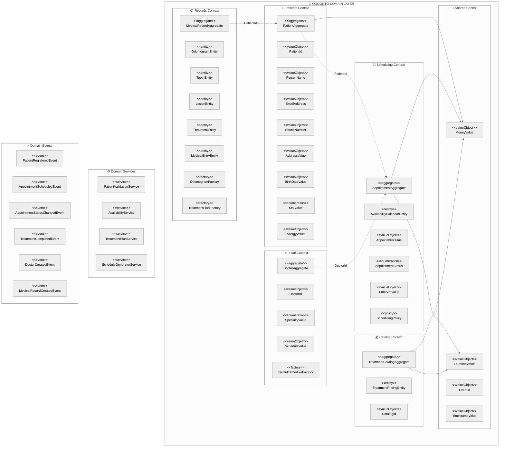

# Odoonto Domain Layer

## Arquitectura del Dominio

La capa de dominio de Odoonto implementa Domain-Driven Design (DDD) con bounded contexts claramente separados para gestionar la complejidad de una plataforma de clínica dental.

### Visión General del Dominio


```

## Bounded Contexts

### 👥 Patients Context

Gestiona toda la información relacionada con los pacientes de la clínica.

**Componentes principales:**
- `PatientAggregate`: Raíz de agregado que encapsula la información del paciente
- Value Objects: `PatientId`, `PersonName`, `EmailAddress`, `PhoneNumber`, `AddressValue`, `BirthDateValue`, `SexValue`, `AllergyValue`

<!-- DIAGRAM: patients-context -->

### 📋 Records Context

Maneja los registros médicos y odontológicos de los pacientes.

**Componentes principales:**
- `MedicalRecordAggregate`: Raíz de agregado para historiales médicos
- Entidades: `OdontogramEntity`, `ToothEntity`, `LesionEntity`, `TreatmentEntity`, `MedicalEntryEntity`
- Factories: `OdontogramFactory`, `TreatmentPlanFactory`

<!-- DIAGRAM: records-context -->

### 📅 Scheduling Context

Gestiona las citas y disponibilidad de la clínica.

**Componentes principales:**
- `AppointmentAggregate`: Raíz de agregado para citas
- `AvailabilityCalendarEntity`: Gestión de disponibilidad
- Value Objects: `AppointmentTime`, `AppointmentStatus`, `TimeSlotValue`
- `SchedulingPolicy`: Políticas de programación

<!-- DIAGRAM: scheduling-context -->

### 👨‍⚕️ Staff Context

Administra el personal médico y sus horarios.

**Componentes principales:**
- `DoctorAggregate`: Raíz de agregado para doctores
- Value Objects: `DoctorId`, `SpecialtyValue`, `ScheduleValue`
- `DefaultScheduleFactory`: Factory para horarios por defecto

<!-- DIAGRAM: staff-context -->

### 💰 Catalog Context

Gestiona el catálogo de tratamientos y precios.

**Componentes principales:**
- `TreatmentCatalogAggregate`: Raíz de agregado para catálogo
- `TreatmentPricingEntity`: Entidad de precios
- Value Objects: `CatalogId`

<!-- DIAGRAM: catalog-context -->

### 🔗 Shared Context

Elementos compartidos entre todos los bounded contexts.

**Componentes principales:**
- Value Objects compartidos: `MoneyValue`, `EventId`, `DurationValue`, `TimestampValue`

<!-- DIAGRAM: shared-context -->

## Servicios de Dominio

- `PatientValidationService`: Validaciones específicas de pacientes
- `AvailabilityService`: Lógica de disponibilidad de citas
- `TreatmentPlanService`: Planificación de tratamientos
- `ScheduleGeneratorService`: Generación de horarios

## Eventos de Dominio

- `PatientRegisteredEvent`: Paciente registrado
- `AppointmentScheduledEvent`: Cita programada
- `AppointmentStatusChangedEvent`: Estado de cita cambiado
- `TreatmentCompletedEvent`: Tratamiento completado
- `DoctorCreatedEvent`: Doctor creado
- `MedicalRecordCreatedEvent`: Historial médico creado

## Principios Arquitectónicos

### Separación de Bounded Contexts
- Cada contexto es independiente y se comunica solo por eventos
- Referencias entre contextos únicamente por ID
- Shared context para elementos verdaderamente compartidos

### Inmutabilidad
- Todos los Value Objects son inmutables
- Campos final y sin setters
- Validación en constructores

### Factories de Dominio
- Para objetos complejos: `OdontogramFactory`, `TreatmentPlanFactory`, `DefaultScheduleFactory`
- Métodos estáticos que devuelven objetos inmutables

### Eventos con Trazabilidad
- Todos los eventos incluyen `EventId` y `TimestampValue`
- Garantizan idempotencia y auditabilidad

## Validación de Arquitectura

Este dominio está validado por tests de arquitectura que garantizan:
- Cumplimiento de DDD y jMolecules
- Separación correcta de bounded contexts
- Inmutabilidad de Value Objects
- Nomenclatura consistente
- Principios SOLID y Clean Code 